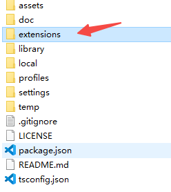
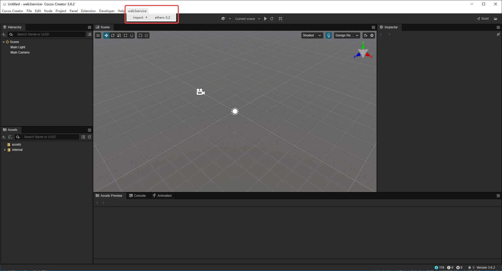
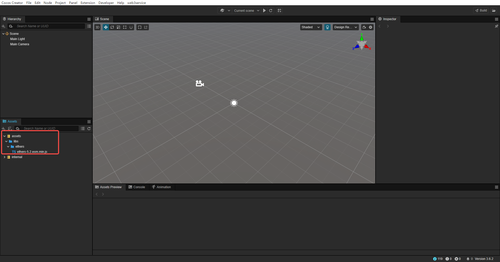

# web3service

- Copy `extensions/web3service` to your Cocos Creator 3.6 Project

- cd `{your project}/extensions/web3service` and run  `npm install`, `npm run build`
- Reopen Cocos Creator Editor, Click Menu `web3service/import/ehers-5.2`, it will copy libs to your project

